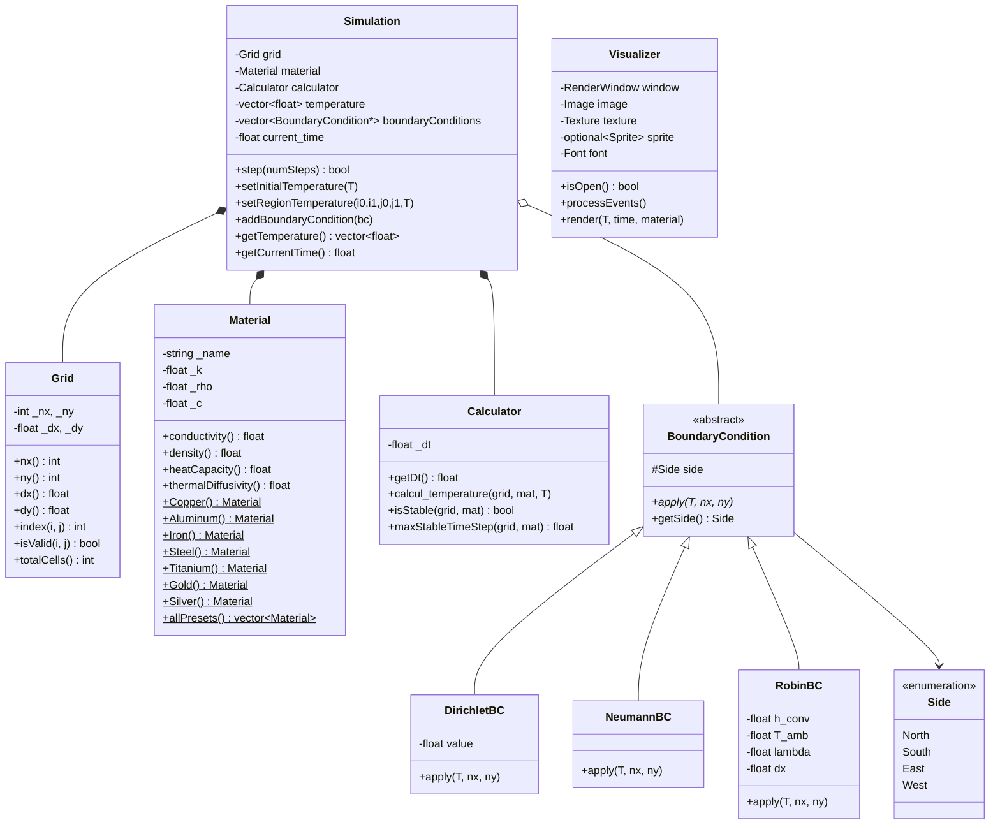

# 2D Thermal Conduction Simulator

A physics-based simulation of 2D heat transfer by conduction, developed as a 4th-year engineering project (EI4 – S8 – 2025/2026). The simulator solves the heat equation on a metallic plate using finite differences and renders the temperature field in real time using SFML.

---

## Overview

This project models how heat propagates through a 2D metallic plate over time. The user selects a metal and a thermal scenario, and the simulation runs continuously — displaying a live heatmap from cold (blue) to hot (red).

The simulation is built around three physical pillars:

- **The heat equation** (parabolic PDE): governs temperature evolution over time
- **Explicit Euler time integration**: simple, fast, conditionally stable
- **Finite difference Laplacian** (5-point stencil): discretises spatial derivatives on a regular grid

---

## Physics & Mathematics

### The Heat Equation

The governing equation for 2D thermal conduction in a homogeneous isotropic medium is:

```
∂T/∂t = α · (∂²T/∂x² + ∂²T/∂y²)
```

where:
- `T(x, y, t)` is the temperature field [°C or K]
- `α = k / (ρ · c)` is the **thermal diffusivity** [m²/s]
- `k` — thermal conductivity [W/(m·K)]
- `ρ` — density [kg/m³]
- `c` — specific heat capacity [J/(kg·K)]

### Spatial Discretisation (5-point stencil)

The Laplacian is approximated using centred finite differences on a regular grid of spacing `dx` and `dy`:

```
∂²T/∂x² ≈ (T[i+1,j] - 2·T[i,j] + T[i-1,j]) / dx²
∂²T/∂y² ≈ (T[i,j+1] - 2·T[i,j] + T[i,j-1]) / dy²
```

Only **interior nodes** (i ∈ [1, nx-2], j ∈ [1, ny-2]) are updated by the solver. Boundary nodes are handled separately by the boundary condition classes.

### Time Integration (Explicit Euler)

```
T[i,j]^(n+1) = T[i,j]^n + dt · α · (�lap_x + lap_y)
```

A temporary copy `T_next` is written at each step so that all reads come from the previous state — this avoids order-dependent bias in the update.

### Stability Condition (CFL)

The explicit scheme is only stable if the time step satisfies:

```
dt ≤ dt_max = 1 / (2α · (1/dx² + 1/dy²))
```

This is the **Courant–Friedrichs–Lewy (CFL)** condition for 2D diffusion. The simulator automatically computes `dt_max` from the chosen material and grid, and rejects any `dt` that would cause divergence.

---

## Technical Architecture

### Class Diagram



---

### Classes

#### `Grid`
Represents the 2D computational mesh. Stores the number of cells `(nx, ny)` and the physical size of each cell `(dx, dy)`. Provides the flat-array indexing function:
```
index(i, j) = i * ny + j
```
where `i` is the column (X axis) and `j` is the row (Y axis).

#### `Material`
Holds the physical properties of a metal: thermal conductivity `k`, density `ρ`, and specific heat `c`. Computes thermal diffusivity `α = k / (ρ·c)` on the fly. Provides seven factory presets with real physical constants:

| Metal     | k [W/(m·K)] | ρ [kg/m³] | c [J/(kg·K)] | α [m²/s]     |
|-----------|-------------|-----------|--------------|--------------|
| Copper    | 401         | 8 960     | 385          | 1.16 × 10⁻⁴ |
| Aluminum  | 237         | 2 700     | 900          | 9.75 × 10⁻⁵ |
| Iron      | 79          | 7 874     | 449          | 2.23 × 10⁻⁵ |
| Steel     | 50          | 7 850     | 502          | 1.27 × 10⁻⁵ |
| Titanium  | 22          | 4 507     | 520          | 9.39 × 10⁻⁶ |
| Gold      | 317         | 19 300    | 129          | 1.27 × 10⁻⁴ |
| Silver    | 429         | 10 500    | 235          | 1.74 × 10⁻⁴ |

#### `Calculator`
Implements the physics solver. Applies the explicit Euler update to all interior nodes. Also checks and computes the maximum stable time step (CFL condition). The `calcul_temperature` method writes results into a separate `T_next` buffer to avoid read/write order artifacts.

#### `BoundaryCondition` (abstract)
Abstract base class for all boundary conditions. Each subclass overrides `apply(T, nx, ny)` and modifies the boundary nodes of the temperature vector in-place. Uses the `Side` enum (North, South, East, West) to know which side to act on.

#### `DirichletBC`
Imposes a **fixed temperature** on a boundary side. All nodes on that side are set to `value` at every time step. Equivalent to a thermostat or a heat source/sink.

#### `NeumannBC`
Imposes a **zero flux** condition (`dT/dn = 0`) — the boundary node copies the value of its nearest interior neighbour. Equivalent to a perfectly insulated side.

#### `RobinBC`
Models **convective heat exchange** with an ambient fluid. Uses Newton's law of cooling discretised as:
```
T_boundary = (λ · T_inner + h · dx · T_amb) / (λ + h · dx)
```
Stores `λ` (material conductivity) and `dx` (cell size) internally so it remains compatible with the `BoundaryCondition` interface.

#### `Simulation`
The central orchestrator. Owns the grid, material, calculator and boundary conditions. Its `step(n)` method runs `n` iterations of:
1. Interior update via `Calculator::calcul_temperature`
2. Boundary enforcement via each `BoundaryCondition::apply`
3. Time advance: `current_time += dt`

#### `Visualizer`
Real-time renderer using SFML 3. Maps each cell's temperature to a heatmap colour (blue → cyan → green → yellow → red), updates an `sf::Image` pixel by pixel, uploads it to an `sf::Texture` and draws it as a sprite. Draws a colour scale bar and material/time info in a bottom panel.

---

## Simulation Scenarios

Four preset scenarios are available to the user:

| # | Name | Description | Boundary conditions |
|---|------|-------------|---------------------|
| 1 | **Hot bar** | Heat rises from a hot source at the bottom toward a cold top | South: Dirichlet (hot), North: Dirichlet (cold), East/West: Neumann |
| 2 | **Hot corner** | Heat radiates from a hot bottom-left corner; other sides lose heat to air | South/West: Dirichlet (hot), North/East: Robin (h=10, T=20°C) |
| 3 | **Furnace** | Three sides are heated strongly; one cold side acts as a heat sink | South/West/East: Dirichlet (hot), North: Dirichlet (cold) |
| 4 | **Cooling plate** | A uniformly hot plate cools through all four sides by convection | All sides: Robin (h=25, T=20°C) |

---

## Heatmap Colour Scale

```
0%                    25%                   50%                   75%                  100%
|—————————————————————|—————————————————————|—————————————————————|—————————————————————|
Blue               Cyan                  Green                Yellow                  Red
(T_min)                                                                              (T_max)
```

---

## Installation & Build

### Prerequisites

| Tool | Version | Install (macOS) |
|------|---------|----------------|
| CMake | ≥ 3.16 | `brew install cmake` |
| SFML | 3.x | `brew install sfml` |
| C++ compiler | C++17 | Xcode Command Line Tools |

### Build

```bash
git clone https://github.com/NadirHal/Thermal-conduction.git
cd Thermal-conduction

cmake -B build -DCMAKE_BUILD_TYPE=Release \
  -DSFML_DIR=$(brew --prefix sfml)/lib/cmake/SFML

cmake --build build
./build/thermal_sim
```

### Run

```
=======================================================
   2D THERMAL CONDUCTION SIMULATION
   Plate size: 80 cm x 80 cm
=======================================================

  STEP 1 — Choose a metal
  [1] Copper   [2] Aluminum   [3] Iron   [4] Steel
  [5] Titanium [6] Gold       [7] Silver
  Your choice: _

  STEP 2 — Choose a scenario
  [1] Hot bar       [2] Hot corner
  [3] Furnace       [4] Cooling plate
  Your choice: _

  Temperature of the heat source (°C): _
```

Press **[Escape]** or close the window to stop the simulation at any time.

---

## Project Structure

```
Thermal-conduction/
├── CMakeLists.txt
├── README.md
├── docs/
│   └── UML.md
├── include/
│   ├── BoundaryCondition.hpp
│   ├── Calculator.hpp
│   ├── DirichletBC.hpp
│   ├── Grid.hpp
│   ├── Material.hpp
│   ├── NeumannBC.hpp
│   ├── Point_2D.hpp
│   ├── RobinBC.hpp
│   ├── Side.hpp
│   ├── Simulation.hpp
│   └── Visualizer.hpp
└── src/
    ├── Calculator.cpp
    ├── DirichletBC.cpp
    ├── NeumannBC.cpp
    ├── RobinBC.cpp
    ├── Simulation.cpp
    ├── Visualizer.cpp
    └── main.cpp
```

---

## Visual Examples

### Hot Bar — Aluminum, 300°C source / 20°C sink
Heat propagates upward uniformly. The gradient stabilises quickly due to aluminum's high diffusivity.

### Hot Corner — Steel, 500°C
The thermal front spreads radially from the bottom-left corner. The low diffusivity of steel creates a sharp, localised gradient.

### Cooling Plate — Copper, 800°C initial
The entire plate cools uniformly from all sides. Copper's very high conductivity means the plate reaches a near-uniform temperature very quickly.

---


## Possible Improvements

- [ ] 3D extension (volumetric heat equation)
- [ ] Interactive heat source 
- [ ] Non-homogeneous materials (spatially varying `α`)
- [ ] Export temperature field to CSV for post-processing
